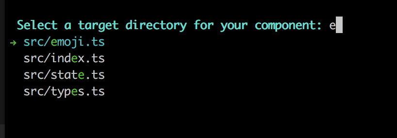

# Inquirer.js

A collection of common interactive command line user interfaces.

## Table of Contents

1.  [Documentation](#documentation)
    1.  [Installation](#installation)
    2.  [Methods](#methods)
        1. [Prompt](#prompt)
        2. [Colors](#color)
        3. [Spinners](#spinner)
        4. [Wait](#wait)
        5. [Url](#url)
        6. [Annotation](#annotation)
        7. [Table](#table)
        8. [Tree](#tree)
        9. [ProgressBar](#progress-bar)
        10. [Notify](#notify)

## [Documentation](#documentation)

<a name="documentation"></a>

### Installation

<a name="installation"></a>

```shell
npm install @cto.ai/sdk
```

```javascript
const { sdk, ux } from '@cto.ai/sdk';
```

# Methods

<a name="methods"></a>

## ux.prompt

<a name="prompt"></a>
Launch the prompt interface

```typescript
const answers = await ux.prompt(questions);
```

Question
A question object is a hash containing question related values:

### Question

<a name="questions"></a>
A question object is a `hash` containing question related values:

- **type**: (String) Type of the prompt. Defaults: `input` - Possible values: `input`, `number`, `confirm`,
  `list`, `rawlist`, `expand`, `checkbox`, `password`, `editor`, `datetime`, `autocomplete`, `checkbox-plus`, `fuzzy-path`, `emoji`
- **name**: (String) The name to use when storing the answer in the answers hash. If the name contains periods, it will define a path in the answers hash.
- **message**: (String|Function) The question to print. If defined as a function, the first parameter will be the current inquirer session answers. Defaults to the value of `name` (followed by a colon).
- **default**: (String|Number|Boolean|Array|Function) Default value(s) to use if nothing is entered, or a function that returns the default value(s). If defined as a function, the first parameter will be the current inquirer session answers.
- **choices**: (Array|Function) Choices array or a function returning a choices array. If defined as a function, the first parameter will be the current inquirer session answers.
  Array values can be simple `strings`, or `objects` containing a `name` (to display in list), a `value` (to save in the answers hash), and a `short` (to display after selection) properties. The choices array can also contain [a `Separator`](#separator).
- **validate**: (Function) Receive the user input and answers hash. Should return `true` if the value is valid, and an error message (`String`) otherwise. If `false` is returned, a default error message is provided.
- **filter**: (Function) Receive the user input and return the filtered value to be used inside the program. The value returned will be added to the _Answers_ hash.
- **transformer**: (Function) Receive the user input, answers hash and option flags, and return a transformed value to display to the user. The transformation only impacts what is shown while editing. It does not modify the answers hash.
- **autocomplete**: (Array|Object) A list of choices to be used for autocomplete. Can be provided either as an array of strings, or as an object with the following properties: name (name to be displayed) and helpInfo (related help information on toggle). When autocomplete is provided, the source attribute is unnecessary.
- **when**: (Function, Boolean) Receive the current user answers hash and should return `true` or `false` depending on whether or not this question should be asked. The value can also be a simple boolean.
- **pageSize**: (Number) Change the number of lines that will be rendered when using `list`, `rawList`, `expand` or `checkbox`.
- **prefix**: (String) Change the default _prefix_ message.
- **suffix**: (String) Change the default _suffix_ message.
- **afterMessage**: (String) replaces `message` after question is answered.

for more information: https://github.com/SBoudrias/Inquirer.js#documentation

### Prompt types

---

> **Note:**: _allowed options written inside square brackets (`[]`) are optional. Others are required._

#### List - `{type: 'list'}`

Take `type`, `name`, `message`, `choices`[, `default`, `filter`] properties. (Note that
default must be the choice `index` in the array or a choice `value`)


---

#### Raw List - `{type: 'rawlist'}`

Take `type`, `name`, `message`, `choices`[, `default`, `filter`] properties. (Note that
default must be the choice `index` in the array)


---

#### Expand - `{type: 'expand'}`

Take `type`, `name`, `message`, `choices`[, `default`] properties. (Note that
default must be the choice `index` in the array. If `default` key not provided, then `help` will be used as default choice)

Note that the `choices` object will take an extra parameter called `key` for the `expand` prompt. This parameter must be a single (lowercased) character. The `h` option is added by the prompt and shouldn't be defined by the user.

See `examples/expand.js` for a running example.


---

#### Checkbox - `{type: 'checkbox'}`

Take `type`, `name`, `message`, `choices`[, `filter`, `validate`, `default`] properties. `default` is expected to be an Array of the checked choices value.

Choices marked as `{checked: true}` will be checked by default.
Choices marked as `{mandatory: true}` will be checked and unselectable by default.

Choices with `helpInfo` property provided will have toggable help info displayed. `helpInfo` property takes in `strings`.
Choices whose property `disabled` is truthy will be unselectable. If `disabled` is a string, then the string will be outputted next to the disabled choice, otherwise it'll default to `"Disabled"`. The `disabled` property can also be a synchronous function receiving the current answers as argument and returning a boolean or a string.


---

#### Confirm - `{type: 'confirm'}`

Take `type`, `name`, `message`, [`default`] properties. `default` is expected to be a boolean if used.


---

#### Input - `{type: 'input'}`

Take `type`, `name`, `message`[, `default`, `filter`, `validate`, `transformer`] properties.


---

#### Input - `{type: 'number'}`

Take `type`, `name`, `message`[, `default`, `filter`, `validate`, `transformer`] properties.

---

#### Password - `{type: 'password'}`

Take `type`, `name`, `message`, `mask`,[, `default`, `filter`, `validate`] properties.


---

Note that `mask` is required to hide the actual user input.

#### Editor - `{type: 'editor'}`

Take `type`, `name`, `message`[, `default`, `filter`, `validate`] properties

Launches an instance of the users preferred editor on a temporary file. Once the user exits their editor, the contents of the temporary file are read in as the result. The editor to use is determined by reading the $VISUAL or $EDITOR environment variables. If neither of those are present, notepad (on Windows) or vim (Linux or Mac) is used.

#### Checkbox with autocomplete - `{type: 'checkbox-plus'}`

Takes `type`, `name`, `message`, `source` or `autocomplete` [, `filter`, `validate`, `default`, `pageSize`, `highlight`, `searchable`, `enablebackspace`, `answer`, `footer`, `header`, `keypress`, `searching`, `noresult`] properties.


for example and more information: https://github.com/yviscool/inquirer-checkbox-plus


#### Fuzzy path - `{type: 'fuzzypath'}`

Take `type`, `name`, `message` [, `excludePath`, `itemType`, `rootPath`, `suggestOnly`]




for example and more information: https://github.com/adelsz/inquirer-fuzzy-path


#### Emoji - `{type: 'emoji'}`

Take `type`, `name`, `message`

for example and more information: https://github.com/tannerntannern/inquirer-emoji


## ux.colors

<a name="colors"></a>

```typescript
ux.colors.green('Green text');
ux.colors.red('Red text');
```

for more information: https://github.com/chalk/chalk#usage

## ux.print

<a name="print"></a>

Prints a string message for the user.

```typescript
await ux.print("Hello world!");
await ux.print(`Found ${records.length} records`);
```

## ux.spinner

<a name="spinner"></a>
Shows a spinner

```typescript
// start the spinner
ux.spinner.start('starting a process');
// show on stdout instead of stderr
ux.spinner.start('starting a process', { stdout: true });

// stop the spinner
ux.spinner.stop(); // shows 'starting a process... done'
ux.spinner.stop('custom message'); // shows 'starting a process... custom message'
```

## ux.wait

<a name="wait"></a>
Waits for 1 second or given milliseconds

```typescript
await cli.wait();
await cli.wait(3000);
```

## ux.url

<a name="url"></a>
Create a hyperlink (if supported in the terminal)

```typescript
await ux.url('sometext', 'https://google.com');
// shows sometext as a hyperlink in supported terminals
// shows https://google.com in unsupported terminals
```

## ux.annotation

<a name="annotation"></a>
Shows an iterm annotation

```typescript
cli.annotation('sometest', 'annotated with this text');
```

## ux.table

<a name="table"></a>
Displays tabular data

```typescript
ux.table(data, columns, options);
```

for more information: https://github.com/oclif/cli-ux#clitable

## ux.tree

<a name="tree"></a>
Generate a tree and display it

```typescript
let tree = cli.tree();
tree.insert('foo');
tree.insert('bar');

let subtree = cli.tree();
subtree.insert('qux');
tree.nodes.bar.insert('baz', subtree);

tree.display();
```

Outputs:

```shell
├─ foo
└─ bar
   └─ baz
      └─ qux
```

## sdk.track

<a name="track"></a>
Send a track event to cto.ai api

```typescript
sdk.track(tags, metadata)
```

- **tags**: (String || String[]) Tags for the event you want to track
- **metaData**: (Object) Data you want to be tracked
